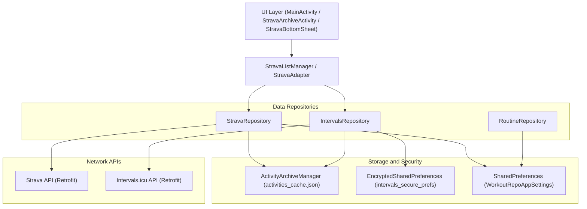
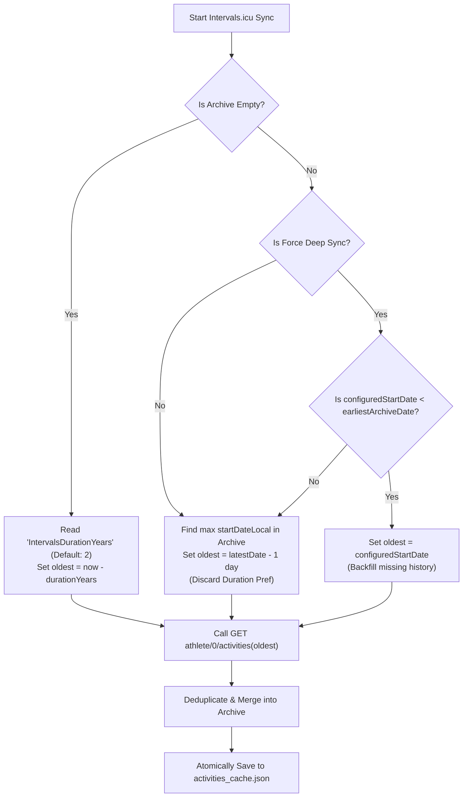
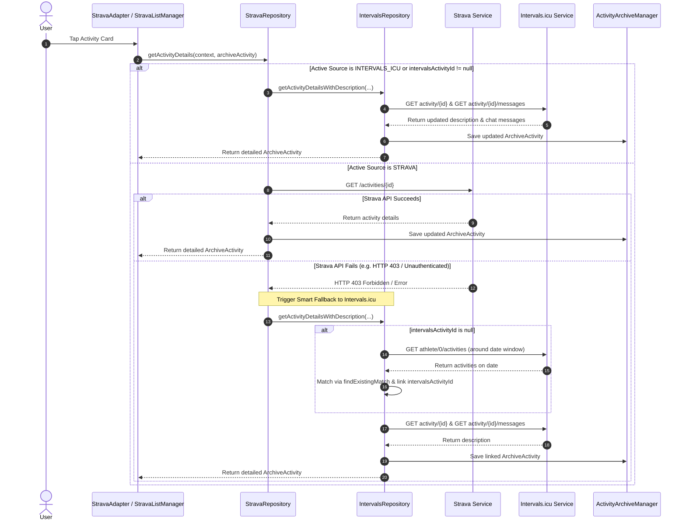

# WorkoutRepo Developer Documentation (Detailed Core Mechanics) (v12.0.0)

This document provides an in-depth mapping of the specific classes, methods, functions, and architectural patterns that power the WorkoutRepo Android application.

---

## 1. Architecture Overview & Multi-Provider Sync Model

WorkoutRepo uses a **Unified Archive System** capable of storing, deduplicating, and rendering workout data from both **Strava** and **Intervals.icu**, while also maintaining local routine templates and widget integrations.



---

## 2. Routine Management & Architecture

WorkoutRepo separates the concept of an **Active Routine** (the one currently being tracked on the main screen) and **Saved Routines** (the library of programs created by the user).

### Core Repository (`RoutineRepository.java`)
Single source of truth for loading and persisting Routines using a JSON file-based approach rather than SQL Room mapping.
- **`getActiveRoutine(Context)`**: Reads `active_routine.json` from `getFilesDir()`. If missing, execution halts and forks to `migrateLegacyData()` to pull data from old `WorkoutPrefs` string mappings.
- **`saveActiveRoutine(Context, Routine)`**: Serializes the routine via Gson's `setPrettyPrinting` and overwrites `active_routine.json`. This acts as the "Active Buffer" that the app is continually operating against.
- **`saveRoutineToLibrary(Context, Routine)`**: Generates a resilient timestamp file via `saved_routines/routine_[UUID].json` for permanent templates.

### UI Editor Synchronization (`WorkoutStorage.java`)
Bridge when the user edits individual values utilizing `EditorBottomSheet.java`.
- **`saveWorkout(Context context, String dayKey, String fieldKey, String value)`**: 
  1. Grabs `RoutineRepository.getActiveRoutine()`.
  2. Synthesizes a local change against the target `DayWorkout` variable (e.g. updating notes).
  3. Executes an immediate save back to the active tracking file.
  4. **Sync Check**: Invokes `isRoutineSaved()` checking if the active ID exists inside `saved_routines/`. If so, it simultaneously commits `RoutineRepository.saveRoutineToLibrary()`.
  5. Forces a UI redraw via `WorkoutsWidgetProvider.Companion.sendRefreshBroadcast()`.

---

## 3. Intervals.icu Integration & Multi-Provider Networking

Due to recent API changes requiring subscriptions for Strava API access, WorkoutRepo natively integrates the **Intervals.icu API** alongside Strava.

### Authentication & Security
- **API Key Storage**: Stored securely using `EncryptedSharedPreferences` (`intervals_secure_prefs`) configured with `AES256_GCM_SPEC` and `MasterKeys`.
- **HTTP Basic Auth Interceptor**: Requests to `https://intervals.icu/api/v1/` automatically attach a Basic Auth header containing `Base64("API_KEY:" + userApiKey)`.
- **Rate Limit Tracking**: Captures `X-RateLimit-Limit` and `X-RateLimit-Remaining` response headers.

### Key API Endpoints (`IntervalsService.kt`)
1. **`GET athlete/0/activities`**: Fetches activity summaries filtered by `oldest` and `newest` ISO date strings.
2. **`GET activity/{id}`**: Fetches detailed single activity JSON (including description/notes edited directly on the Intervals.icu website).
3. **`GET activity/{id}/messages`**: Fetches user comments and chat thread messages for lazy loading.
4. **`GET athlete/0/wellness`**: Fetches athlete fitness and fatigue metrics (`ctl`, `atl`, `tsb`).

### Unified Archive Model (`ArchiveActivity.kt`)
The archive data model unifies both providers:
```kotlin
data class ArchiveActivity(
    val id: String = UUID.randomUUID().toString(),
    val stravaActivityId: Long? = null,
    val intervalsActivityId: String? = null,
    val source: SourceProvider = SourceProvider.STRAVA,
    val name: String,
    val distance: Float,
    val movingTime: Int,
    val startDateLocal: String,
    val averageWatts: Float? = null,
    val averageHeartrate: Float? = null,
    val totalElevationGain: Float? = null,
    val type: String,
    val workoutType: Int? = null,
    val description: String? = null,
    val lastModifiedLocal: Long = System.currentTimeMillis()
)
```

---

## 4. Sync Strategy, Deduplication & Dynamic Boundaries

### Incremental Sync Boundary Calculation
To prevent burning API rate limits while respecting preloaded/imported historical archives, `IntervalsRepository.syncActivities()` calculates `oldest` dynamically:



### Heuristic Deduplication (`ActivityArchiveManager.findExistingMatch`)
When syncing activities from Intervals.icu into an archive that contains existing Strava activities, `findExistingMatch` merges duplicate entries:

1. **Strict ID Check**: Matches if `candidate.stravaActivityId == existing.stravaActivityId` or `candidate.intervalsActivityId == existing.intervalsActivityId`.
2. **Sport Type Matching**: Mapped via `SportTypeMapper`. Supports `"Unknown"` as a wildcard matching key.
3. **Robust ISO Date Parsing**: Converts `startDateLocal` via `parseToLocalDateTime()` using `OffsetDateTime` to handle ISO format variances (with/without `Z` or UTC offsets). Matches if within a **12-hour temporal window**.
4. **Moving Time Tolerance**: Compares `movingTime` with a **~5% tolerance window**.

When a match occurs, the existing entry is updated to store both `stravaActivityId` and `intervalsActivityId`, preserving descriptions and local edits!

---

## 5. Lazy Loading & Smart Description Fallback

To minimize network overhead, detailed workout notes and chat threads are lazily fetched when the user taps an activity card.



---

## 6. UI Control Flow & Component Mechanics

### IME-Gated Settings UI (`GuideAdapter.java` & `settings_app.xml`)
- **Duration Input (`id/tilDuration_icu` & `id/etDuration_icu`)**: Allows the user to enter custom initial fetch duration (in years).
- **Save API Details Button (`id/saveAPIDetails`)**:
  - Hidden by default (`View.GONE`).
  - Listens to soft keyboard insets via `ViewCompat.setOnApplyWindowInsetsListener` and focus changes on `etAPIKey_icu` / `etDuration_icu`.
  - Becomes `VISIBLE` **only** when the IME (keyboard) is visible **AND** an input field is focused.
  - Tapping Save persists the credentials, clears focus, hides the keyboard, and sets button visibility to `View.GONE`.

### Native State Selectors for Source Selection Buttons
The `selectStrava` and `selectICU` source choice buttons use Android state selectors (`button_background_selector_strava.xml` & `icu.xml`):
- **Selected State (`android:state_selected="true"`)**: Displays a **2dp outer border layer-list with visible gap** (`rounded_corners_strava_border` / `intervalsicu_border`).
- **Unselected State (Default)**: Displays a **0dp outer border layer-list** (`rounded_corners_button_border_disabled_strava` / `icu`).
- **Code Control**: Handled cleanly in `GuideAdapter.java` via `sHolder.btnSelectStrava.setSelected(isStrava)` and `sHolder.btnSelectICU.setSelected(isICU)`.

---

## 7. Complete Codebase File Index

| Directory / File                                                                                                                                                              | Description & Functionality                                                                                                            |
|:------------------------------------------------------------------------------------------------------------------------------------------------------------------------------|:---------------------------------------------------------------------------------------------------------------------------------------|
| **`com.gratus.workoutrepo`**                                                                                                                                                  |                                                                                                                                        |
| [BaseActivity.java](file:///C:/Users/rkhar/Documents/ANDROID%20APPS/WorkoutRepo/app/src/main/java/com/gratus/workoutrepo/BaseActivity.java)                                   | Base activity class handling edge-to-edge system insets, night mode theme routing (`applyTheme`), and preference keys.                 |
| [MainActivity.java](file:///C:/Users/rkhar/Documents/ANDROID%20APPS/WorkoutRepo/app/src/main/java/com/gratus/workoutrepo/MainActivity.java)                                   | Main entry controller managing infinite week swipe pager, MotionLayout drawer, and settings change listeners.                          |
| [RoutinesActivity.java](file:///C:/Users/rkhar/Documents/ANDROID%20APPS/WorkoutRepo/app/src/main/java/com/gratus/workoutrepo/RoutinesActivity.java)                           | Routine library browser with horizontal `PagerSnapHelper`, template import/export, and routine lifecycle management.                   |
| [StravaArchiveActivity.kt](file:///C:/Users/rkhar/Documents/ANDROID%20APPS/WorkoutRepo/app/src/main/java/com/gratus/workoutrepo/StravaArchiveActivity.kt)                     | Full-screen history viewer. Displays activity list and populates athlete wellness metrics (`fitnessRow`) when Intervals.icu is active. |
| [StravaBottomSheet.kt](file:///C:/Users/rkhar/Documents/ANDROID%20APPS/WorkoutRepo/app/src/main/java/com/gratus/workoutrepo/StravaBottomSheet.kt)                             | Quick-access bottom sheet filtering workout history by day of the week.                                                                |
| [EditorBottomSheet.java](file:///C:/Users/rkhar/Documents/ANDROID%20APPS/WorkoutRepo/app/src/main/java/com/gratus/workoutrepo/EditorBottomSheet.java)                         | Textual content editor for routine workouts with unsaved text confirmation protection.                                                 |
| **`com.gratus.workoutrepo.archive`**                                                                                                                                          |                                                                                                                                        |
| [ArchiveActivity.kt](file:///C:/Users/rkhar/Documents/ANDROID%20APPS/WorkoutRepo/app/src/main/java/com/gratus/workoutrepo/archive/model/ArchiveActivity.kt)                   | Core unified activity data class supporting Strava and Intervals.icu IDs and metrics.                                                  |
| [ActivityArchiveManager.kt](file:///C:/Users/rkhar/Documents/ANDROID%20APPS/WorkoutRepo/app/src/main/java/com/gratus/workoutrepo/archive/data/ActivityArchiveManager.kt)      | Atomic disk persistence manager (`activities_cache.json`), legacy data migrator, and heuristic deduplication engine.                   |
| [SportTypeMapper.kt](file:///C:/Users/rkhar/Documents/ANDROID%20APPS/WorkoutRepo/app/src/main/java/com/gratus/workoutrepo/archive/utils/SportTypeMapper.kt)                   | Maps provider-specific sport type strings to standardized UI activity categories.                                                      |
| **`com.gratus.workoutrepo.intervalsicu`**                                                                                                                                     |                                                                                                                                        |
| [IntervalsService.kt](file:///C:/Users/rkhar/Documents/ANDROID%20APPS/WorkoutRepo/app/src/main/java/com/gratus/workoutrepo/intervalsICU/network/IntervalsService.kt)          | Retrofit REST interface for Intervals.icu (`activities`, `activity/{id}`, `messages`, `wellness`).                                     |
| [IntervalsRepository.kt](file:///C:/Users/rkhar/Documents/ANDROID%20APPS/WorkoutRepo/app/src/main/java/com/gratus/workoutrepo/intervalsICU/repository/IntervalsRepository.kt) | Encrypted API key manager, incremental sync coordinator, single activity detail fetcher, and wellness metric provider.                 |
| [IntervalsModels.kt](file:///C:/Users/rkhar/Documents/ANDROID%20APPS/WorkoutRepo/app/src/main/java/com/gratus/workoutrepo/intervalsICU/data/IntervalsModels.kt)               | Data models for Intervals.icu responses (`IntervalsActivity`, `IntervalsMessage`, `IntervalsWellness`).                                |
| **`com.gratus.workoutrepo.strava`**                                                                                                                                           |                                                                                                                                        |
| [StravaRepository.kt](file:///C:/Users/rkhar/Documents/ANDROID%20APPS/WorkoutRepo/app/src/main/java/com/gratus/workoutrepo/strava/repository/StravaRepository.kt)             | Strava API repository featuring parallel page fetching, token management, and smart fallback routing to Intervals.icu.                 |
| [StarvaAdapter.kt](file:///C:/Users/rkhar/Documents/ANDROID%20APPS/WorkoutRepo/app/src/main/java/com/gratus/workoutrepo/strava/adapters/StarvaAdapter.kt)                     | `RecyclerView.Adapter` with `DiffUtil` support, lazy loading indicators, long-press web launch, and dynamic icon rendering.            |
| [StravaListManager.kt](file:///C:/Users/rkhar/Documents/ANDROID%20APPS/WorkoutRepo/app/src/main/java/com/gratus/workoutrepo/strava/utils/StravaListManager.kt)                | UI controller for search filters, date range pickers, list binding, and on-demand detail fetching.                                     |
| **`com.gratus.workoutrepo.adapters`**                                                                                                                                         |                                                                                                                                        |
| [GuideAdapter.java](file:///C:/Users/rkhar/Documents/ANDROID%20APPS/WorkoutRepo/app/src/main/java/com/gratus/workoutrepo/adapters/GuideAdapter.java)                          | Settings page adapter managing source selection (`setSelected`), IME-gated save button, and preference persistence.                    |
| [WeekPagerAdapter.java](file:///C:/Users/rkhar/Documents/ANDROID%20APPS/WorkoutRepo/app/src/main/java/com/gratus/workoutrepo/adapters/WeekPagerAdapter.java)                  | Virtual infinite pager adapter for main week view.                                                                                     |
| **`com.gratus.workoutrepo.widgets`**                                                                                                                                          |                                                                                                                                        |
| [WorkoutsWidgetProvider.kt](file:///C:/Users/rkhar/Documents/ANDROID%20APPS/WorkoutRepo/app/src/main/java/com/gratus/workoutrepo/widgets/WorkoutsWidgetProvider.kt)           | App widget receiver handling date updates, active routine binding, and RemoteViews refreshes.                                          |
