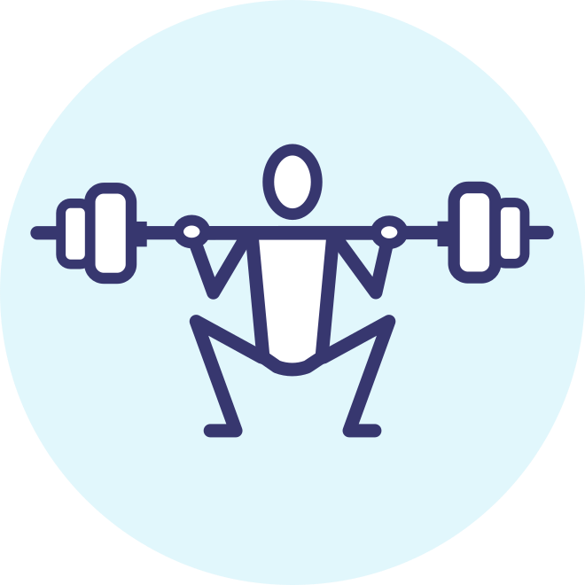
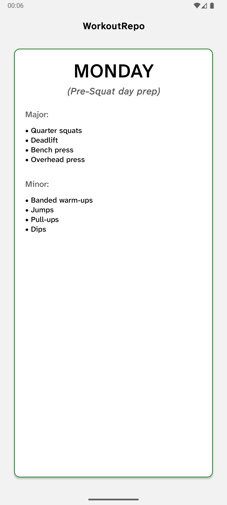
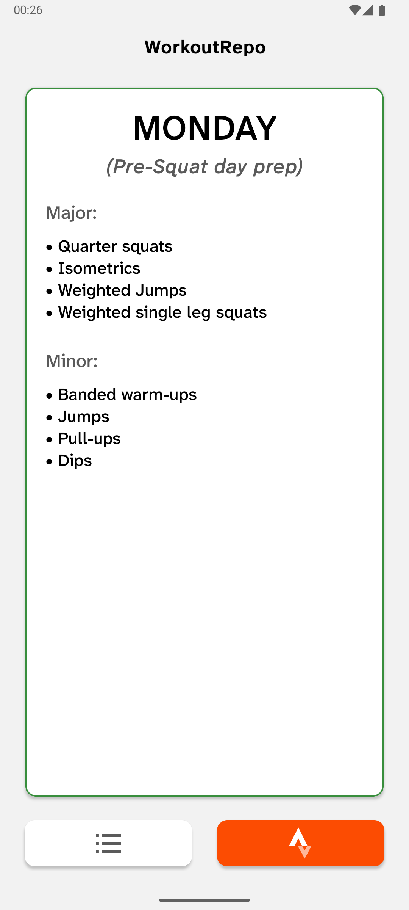
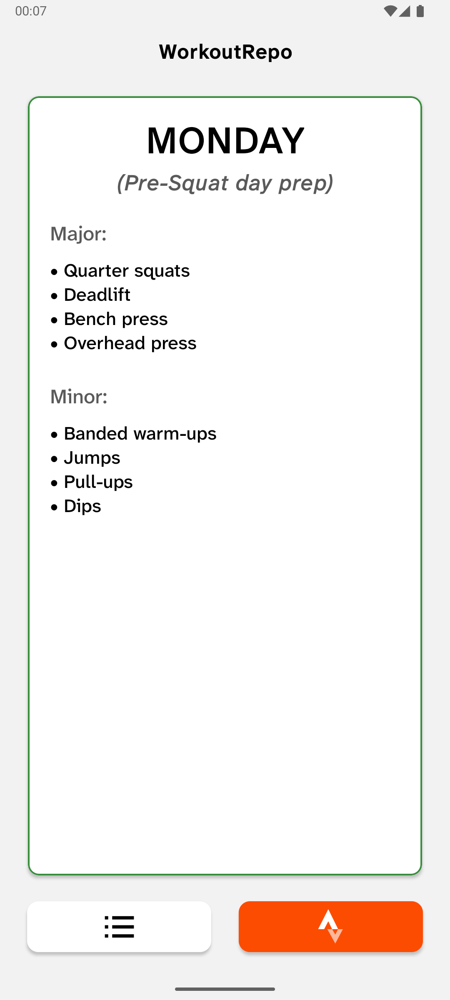
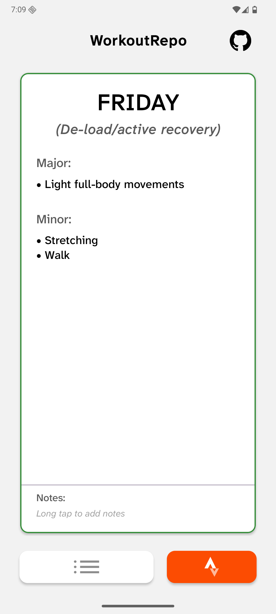
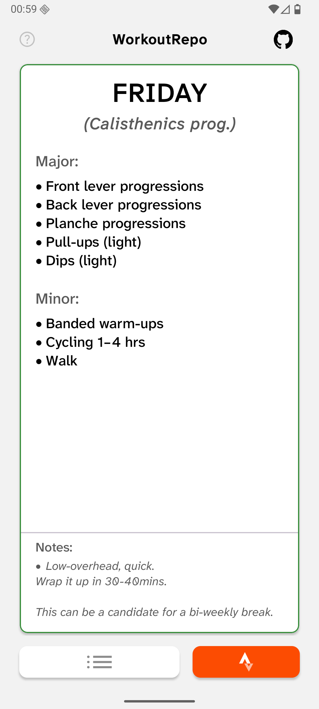

    
    <h1>WorkoutRepo</h1>

**WorkoutRepo** is a workout routine managment app that can be simply put as a GUI for your workout excel sheet, _more like a workout reminder_.
Additionally, this app has the ability to sycn your workout history from Strava and Intervals.icu using personal API keys.
##### Not to be mistaken for a *workout logger*.

#### _Google Play protect may ask to scan the app before installing; let it scan. **The app is safe to use.**_

## Features
- Set multiple weekly routines
- See weekday-wise planned workout on home screen
- Notes per week day and per routine
- Home screen widget
- Native text-formatting: **bold**, _italic_ and bullet/sub-bullet points
- Sync Strava activties using your client keys (_only works for subscribers from **30th June, 2026** onwards_)
- Sync Intervals.icu activites using your API key
- Filter according to actvity type and date
- Simple stats in Archive Screen for any selected range
- A local, export-able, archive of the activites synced
- Securely stores your API keys in encrypted sharedprefs

## Screenshtos
For detailed screenshots, check _[here](screenshots_detailed.md)_.

Home Screen and  App settings
<table>
  <tr>
    <td width="20%">Home</td>
    <td width="20%">Guide</td>
    <td width="20%">Settings Intervals.icu</td>
  </tr>
  <tr>
    <td></td>
    <td></td>
    <td></td>
  </tr>
</table>

Routine Screen
<table>
  <tr>
    <td width="20%">Routine View</td>
    <td width="20%">Add Rotuine options</td>
  </tr>
  <tr>
    <td></td>
    <td></td>
  </tr>
</table>

Activity Screen
<table>
  <tr>
    <td width="50%">Activities Filter applied</td>
    <td width="50%">Actvity Bottomsheet</td>
  </tr>
  <tr>
    <td></td>
    <td></td>
  </tr>
</table>

## Getting started
Download to install from _**[GitHub Releases](https://www.github.com/spewedprojects/WorkoutRepo/releases/latest)**_

#### Absolute "No-frills" WorkoutRepo: [v3.3.g](https://github.com/spewedprojects/WorkoutRepo/releases/tag/v3.3.g)
- **Barebones**
- No Strava/Intervals.icu implementation, button only opens your Strava Profile
- No multi-routines switcher
#### Revamped WorkoutRepo with routines: [v4.0.0 onwards](https://github.com/spewedprojects/WorkoutRepo/releases/tag/v4.0.0)
- Strava/Intervals.icu implementation using API keys, button opens another screen containing activities
- Multi-routines switcher

## App progression over time:
<table>
  <tr>
    <td width="20%">v1</td>
    <td width="20%">v2</td>
    <td width="20%">v3</td>
    <td width="20%">v5</td>
    <td width="20%">v7</td>
  </tr>
  <tr>
    <td></td>
    <td></td>
    <td></td>
    <td></td>
    <td></td>
  </tr>
</table>
