Home Screen and  App settings
<table>
  <tr>
    <td width="20%">Home</td>
    <td width="20%">Guide</td>
    <td width="20%">Settings Strava</td>
    <td width="20%">Settings Intervals.icu</td>
  </tr>
  <tr>
    <td>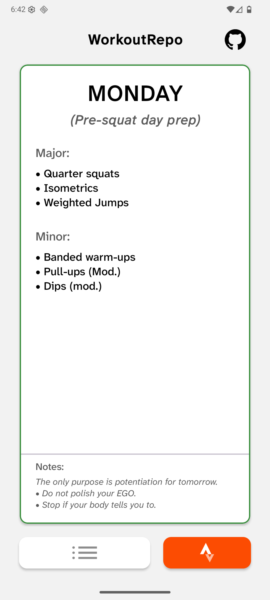</td>
    <td>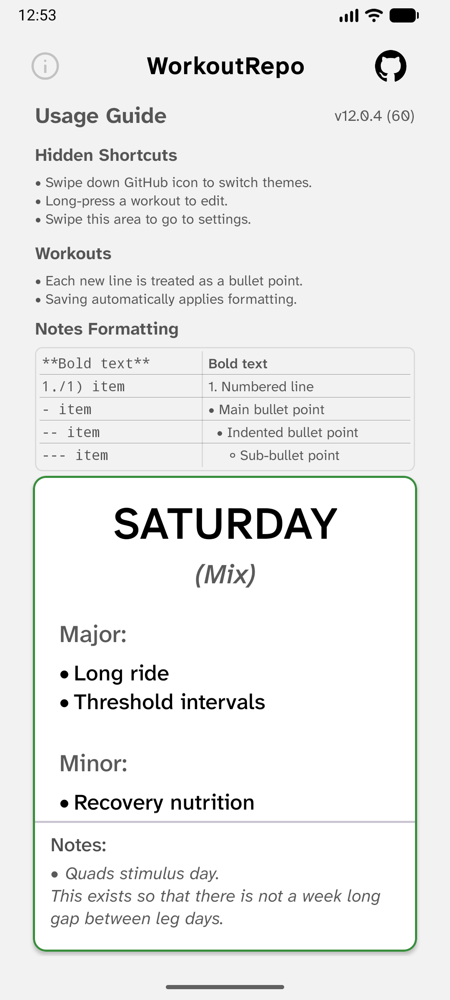</td>
    <td>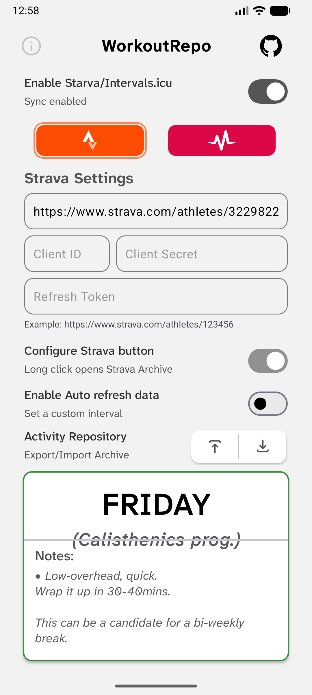</td>
    <td>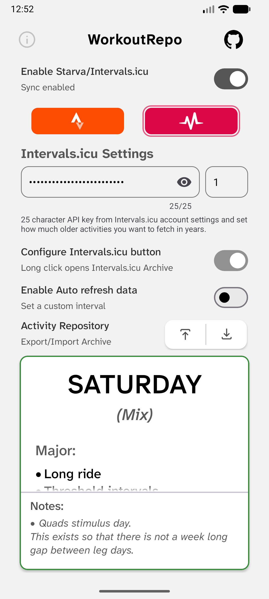</td>
  </tr>
</table>

Routine Screen
<table>
  <tr>
    <td width="20%">Routine View</td>
    <td width="20%">Rutine Edit mode</td>
    <td width="20%">Add Rotuine options</td>
  </tr>
  <tr>
    <td>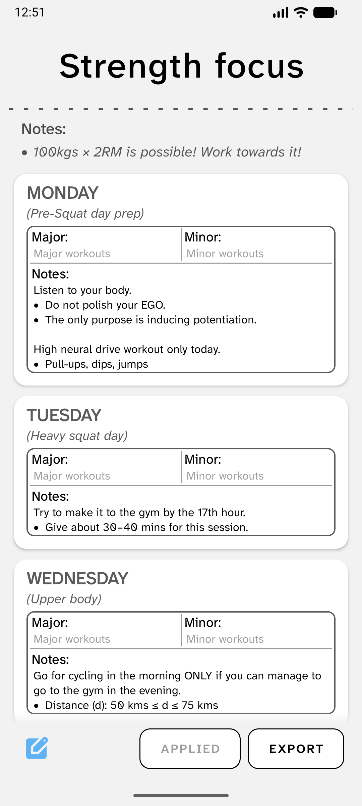</td>
    <td>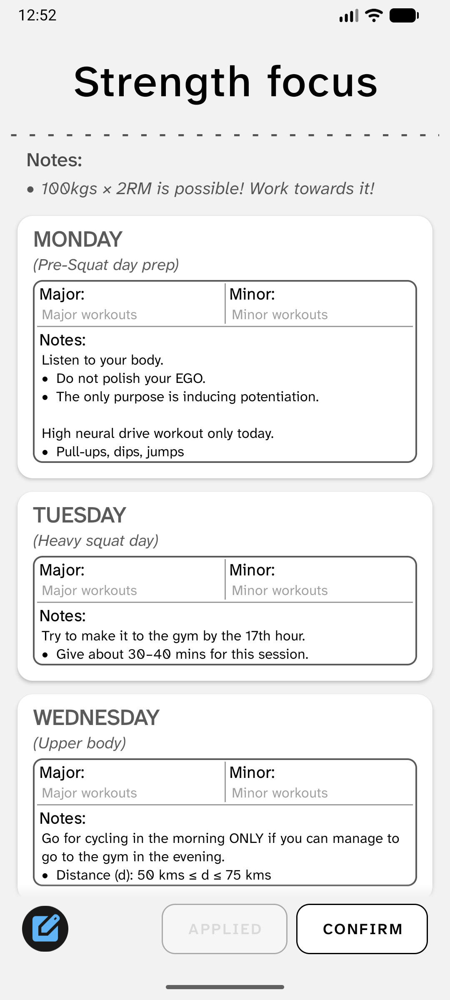</td>
    <td>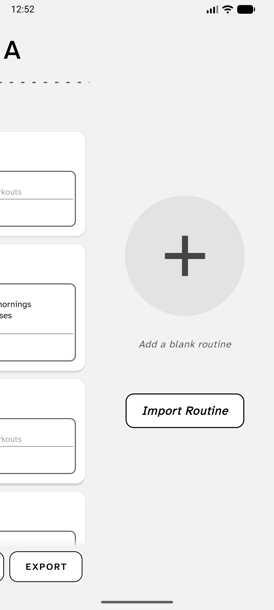</td>
  </tr>
</table>

Activity Screen
<table>
  <tr>
    <td width="20%">Activities</td>
    <td width="20%">Activities Filter applied</td>
    <td width="20%">Actvity Bottomsheet</td>
  </tr>
  <tr>
    <td>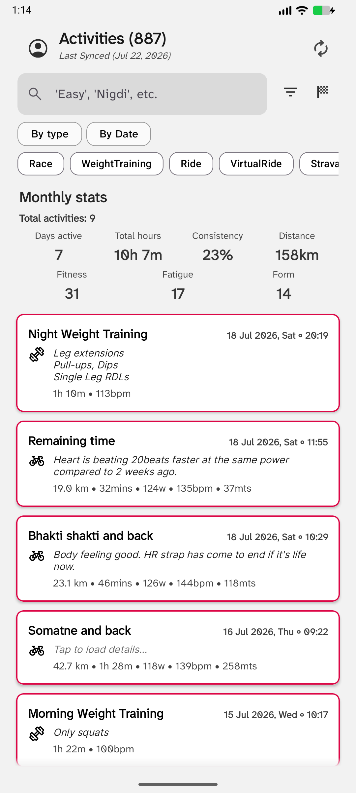</td>
    <td>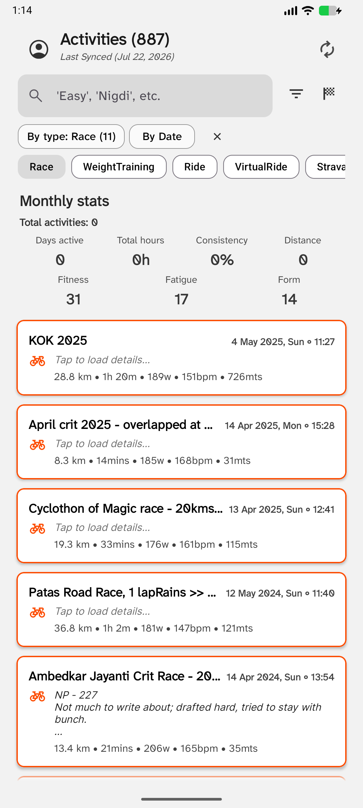</td>
    <td>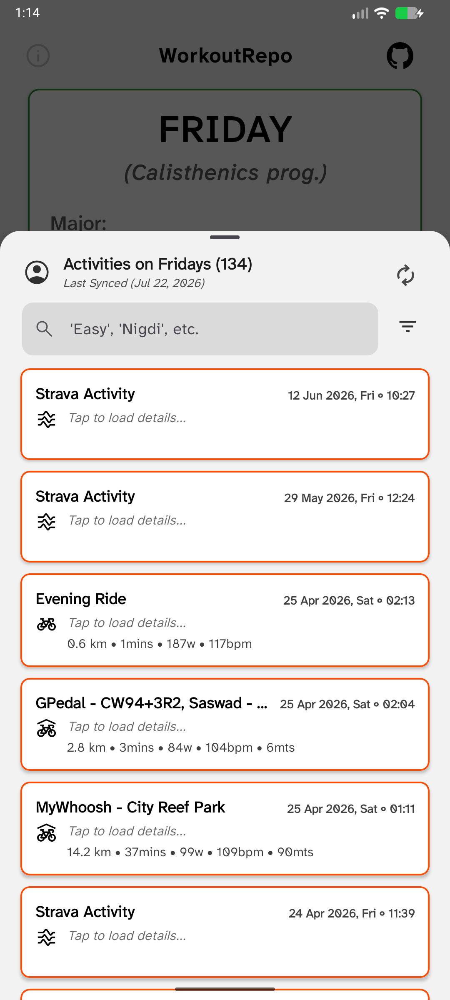</td>
  </tr>
</table>

Dialogs and Bottomsheets - Confirmation, API change, Deletion, Editing
<table>
  <tr>
    <td width="25%">Confirm Delete</td>
    <td width="25%">Confirm Discard</td>
    <td width="25%">Athelet change warning</td>
    <td width="25%">Workout edit</td>
  </tr>
  <tr>
    <td>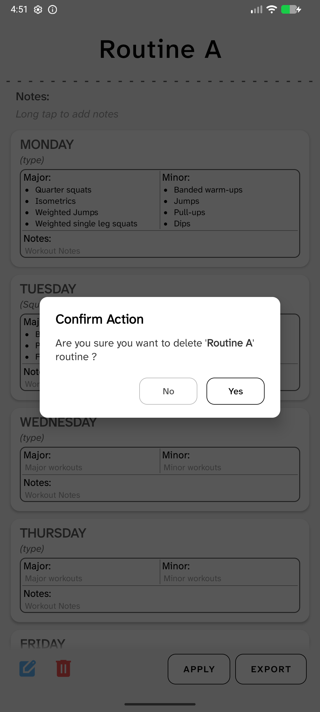</td>
    <td>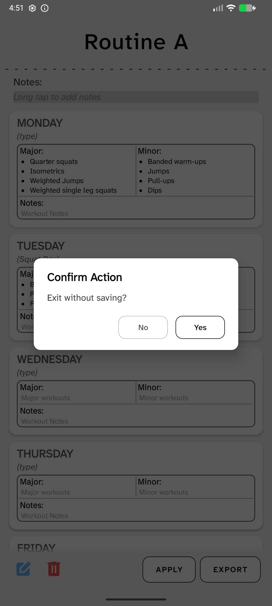</td>
    <td>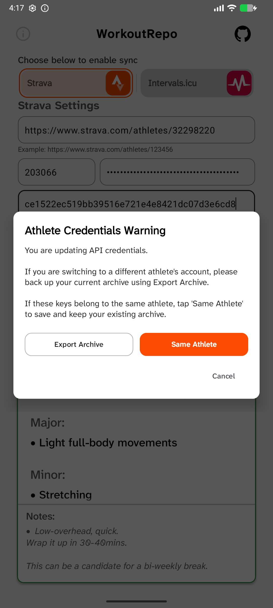</td>
    <td>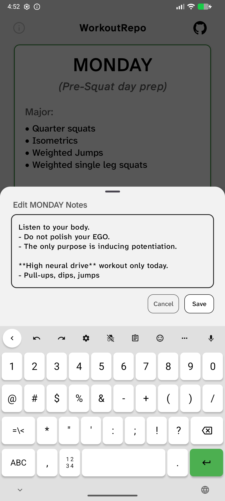</td>
  </tr>
</table>